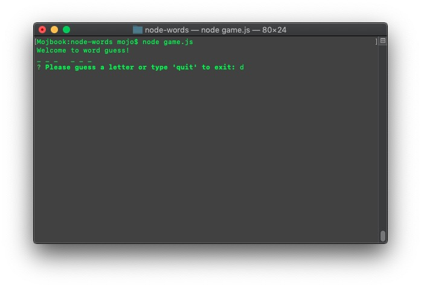
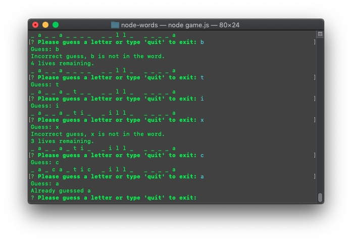

# node-words
Terminal Word Guess Game / Constructor fun!

## Game Basics
To run game, clone repository on your local computer and execute 'npm install' to install the game dependencies.

Once installed, run game by typing 'node game.js' while in the same working directory from the terminal.

Words are guessed at random from the accompanying wordlist.txt file, feel free to change the word list for your game! Phrases must be on their own line, separated by newlines.

You have 5 guesses to find the word, repeat guesses and entries more than one character in length are ignored. You may type 'quit' to exit the game. Upon winning or losing, the game will choose a new word and restart until the game is closed.

